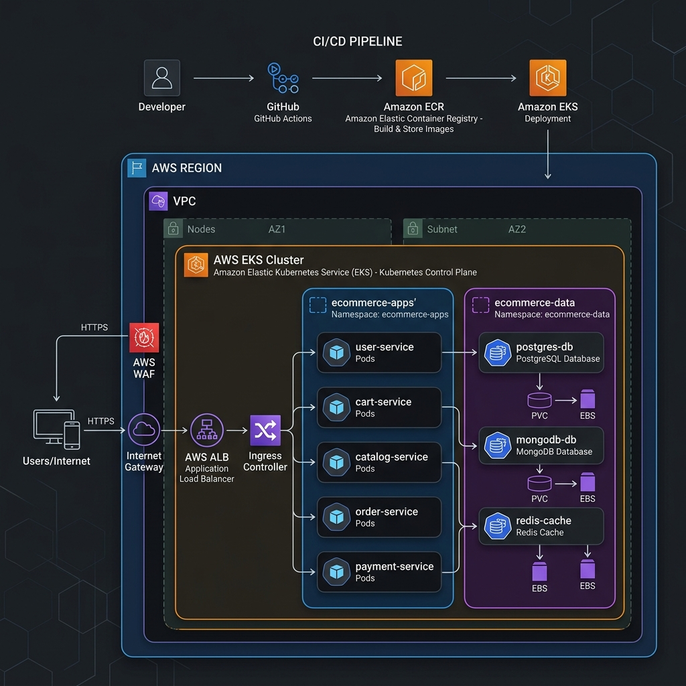

# ShopMicro — E-Commerce Microservices

> **High-availability e-commerce platform** leveraging polyglot microservices, modular Terraform, and OIDC-authenticated CI/CD pipelines. Optimized for security and cost (NAT-less VPC architecture).



---

### 🚀 Core DevOps Highlights

- **Cost-Optimized VPC**: Replaced NAT Gateway with **VPC Endpoints** (S3, SSM, ECR), saving ~$32/month.
- **Identity Federation**: Workflows use **GitHub OIDC** for AWS authentication (No stored secrets).
- **Golden Image Strategy**: Pre-baked AMIs for near-instant Auto Scaling Group (ASG) transitions.
- **Serverless Integration**: Payments handled via Lambda + API Gateway for elastic scalability.
- **Security-First**: Enforced **IMDSv2**, multi-stage Docker builds (non-root), and encrypted S3 state backends.

---

### 🛠️ Technology Stack

| Layer | Tech | Infrastructure (AWS) |
| :--- | :--- | :--- |
| **Edge** | CloudFront (CDN) | SSL/HTTPS Termination |
| **Entry** | Nginx Reverse Proxy | Application Load Balancer (ALB) |
| **Backend** | Node.js, Python 3.12 | Auto Scaling Group (Private Subnets) |
| **Data** | Mongo, Postgres, Redis | S3 Customer Data (AES-256) |
| **IaC** | Terraform 1.5+ | Remote S3 State + DynamoDB Locking |
| **CI/CD** | GitHub Actions | GitOps Pattern (Production & Previews) |

---

### 📂 Project Architecture

```bash
├── .github/workflows/    # OIDC-based CI/CD (6 Deploy + 6 Preview + Cleanup)
├── web-app/
│   ├── ecommerce-microservices/ # Main App (Nginx, 5 Microservices, Compose)
│   ├── k8s/              # Kubernetes Manifests (Apps, DBs, Secrets, Ingress)
│   ├── modules/          # Reusable IaC: [Network, Compute, Storage, IAM, EKS]
│   └── environments/     # Layered Orchestration (Dev/Prod)
└── docs/images/          # System Architecture Diagrams
```

---

### 🏗️ Infrastructure as Code

Modular Terraform with **Isolated State Layers** to minimize blast radius:

1.  **Network**: VPC, Public/Private Subnets, Security Groups, VPC Endpoints.
2.  **Storage**: Encrypted S3 buckets with Versioning and Lifecycle policies.
3.  **Compute / EKS**: Elastic Kubernetes Service (EKS) clusters or EC2 Auto Scaling Groups.

**Deployment (Dev/Prod):**
```bash
cd environments/<env>/network && terraform apply
cd environments/<env>/storage && terraform apply
cd environments/<env>/eks && terraform apply
```

---

### ☸️ Kubernetes Orchestration (EKS)

The application has been modernized to run on **Amazon Elastic Kubernetes Service (EKS)**, ensuring high availability, scalable deployments, and robust resource isolation:

- **Namespaces**: Separation of concerns via dedicated namespaces: `ecommerce-apps` (microservices), `ecommerce-data` (databases), and `ecommerce-ingress` (routing).
- **Ingress Controller**: Utilizes the **AWS Load Balancer Controller** to provision an internet-facing ALB that intelligently routes traffic to specific services using path-based rules (`/api/users`, `/api/cart`, etc.).
- **Stateful Deployments**: Databases (MongoDB, PostgreSQL) are deployed as `StatefulSets` with dynamically provisioned `PersistentVolumeClaims (PVCs)` to ensure data durability across pod restarts.
- **Secrets Management**: Sensitive credentials and connection strings are securely stored as Kubernetes `Secret` objects, injected into pods at runtime, and completely omitted from version control.
- **Headless Services**: Databases utilize `clusterIP: None` headless services to provide stable DNS resolution for stateful pods.

---

### 🔄 CI/CD Pipelines

#### Production Delivery (`main` branch)
Every service has a dedicated pipeline that triggers on path-specific changes:
1. **OIDC Auth**: GitHub assumes `GitHubActionRole` via OIDC.
2. **Build**: Multi-stage Docker build → Push to **Amazon ECR**.
3. **Deploy**: Update GitOps Repo + **SSM Shell Command** to EC2 for zero-downtime `docker-compose up`.

#### PR Preview Environments
Labeling a PR with `pr-deploy` spins up a temporary environment (Push to Docker Hub + GitOps manifest creation), which is automatically cleaned up on PR close.

---

### 🔒 Security Implementation

- **Compute**: Instances reside in **Private Subnets**; SSH disabled (Access via SSM Session Manager).
- **Network**: Strict SG rules (ALB → EC2 → DB); VPC Endpoints for internal service traffic.
- **Docker**: All images pass **ECR Scan-on-Push**; services run as `USER node` (non-root).
- **IaC**: State files encrypted at rest; sensitive variables injected at runtime via userdata.

---

### 🚦 Quick Start

**Local Development:**
```bash
cp .env.example .env
cd web-app/ecommerce-microservices && docker-compose up -d
```

**Access Points:**
- **Storefront**: `http://localhost/`
- **Catalog API**: `http://localhost/api/products`
- **User API**: `http://localhost/api/users`

### 🤝 Collaboration & Development

For detailed onboarding, environment setup, and branching strategies, please refer to:
- [CONTRIBUTING.md](./CONTRIBUTING.md) — How to contribute and code standards.
- [docs/environments.md](./web-app/environments/README.md) — Detailed infra deployment order.

**Quick Setup Checklist:**
1. Configure AWS CLI with `AdministratorAccess`.
2. Install Terraform `v1.5+` & Docker Desktop.
3. Use `terraform fmt` before every commit.

<p align="center"><sub>Built with ❤️ by Amr Elzoghby</sub></p>
